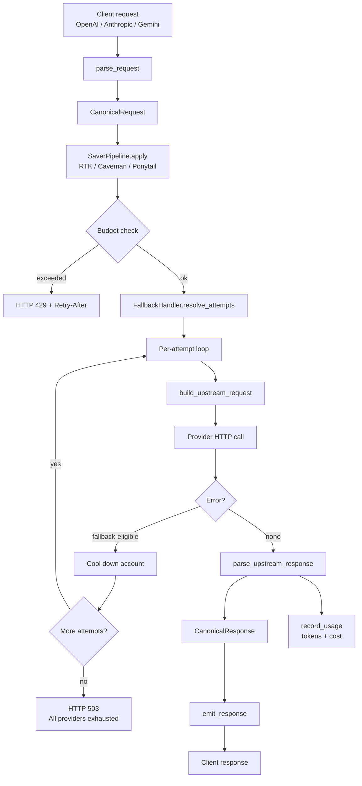

# Architecture

This page describes Janus's internal design: the canonical intermediate model,
request flow, adapter system, routing layer, provider lifecycle, storage, and
pricing.

## Canonical intermediate model

The core design principle of Janus is the **canonical intermediate model**.
Every request is translated into a neutral `CanonicalRequest`, processed, and
then translated into the upstream provider's native format. Responses come back
as a `CanonicalResponse` and are translated into the client's format.

```
Client format ──parse──▶ CanonicalRequest ──build──▶ Provider format
                          (routing, savers, budgets)
Client format ◀──emit─── CanonicalResponse ◀──parse── Provider response
```

The boundary rule:

> `formats/` and `providers/` never import or call each other — they only talk
> through `canonical/`.

This gives **2N adapters** instead of N² translators. Supporting 3 client
formats and 4 provider types requires 3 + 4 = 7 adapters, not 12 translators.
Adding a new format or provider touches exactly one adapter.

## Request flow



Step by step:

1. **Client sends** a request in its native format (OpenAI, Anthropic, or
   Gemini) to `/v1/chat/completions`, `/v1/messages`, or
   `/v1beta/models/{model}:generateContent`.
2. **`parse_request`** converts the raw request body into a `CanonicalRequest`.
3. **`SaverPipeline.apply`** runs enabled token savers (RTK, Caveman, Ponytail)
   in sequence. Fail-safe — exceptions are caught and logged.
4. **Budget check** (`_check_budgets`) evaluates per-key and global budgets. If
   any is exceeded, the request is rejected with `HTTP 429 + Retry-After`.
5. **`FallbackHandler.resolve_attempts`** generates an ordered list of
   `ResolvedTarget`s — expanding combos to models, models to all available
   accounts (including inventory-expanded keys), filtering out cooled-down
   accounts.
6. **Per-attempt loop**: for each target:
   - `build_upstream_request` converts the `CanonicalRequest` to the provider's
     native format.
   - The provider executes the HTTP call (streaming or non-streaming).
   - `parse_upstream_response` converts the provider response to a
     `CanonicalResponse`.
7. **On success**: `emit_response` converts the `CanonicalResponse` back to the
   client's format. `record_usage` stores token counts and computed cost.
8. **On fallback-eligible error**: the account is cooled down and the next
   attempt is tried.
9. **If all attempts fail**: the client receives `HTTP 503` with an
   `All providers exhausted` message.

## Format adapters

Three format adapters are registered in the `FORMATS` dict:

| Adapter | Client endpoint | Files |
|---|---|---|
| `OpenAIAdapter` | `POST /v1/chat/completions` | `formats/openai.py` |
| `AnthropicAdapter` | `POST /v1/messages` | `formats/anthropic.py` |
| `GeminiAdapter` | `POST /v1beta/models/{model}:generateContent` | `formats/gemini.py` |

Each adapter implements six methods (the `FormatAdapter` protocol):

| Method | Direction | Description |
|---|---|---|
| `parse_request` | client → canonical | Convert raw request body to `CanonicalRequest` |
| `build_upstream_request` | canonical → provider | Convert `CanonicalRequest` to provider payload |
| `parse_upstream_response` | provider → canonical | Convert provider JSON to `CanonicalResponse` |
| `emit_response` | canonical → client | Convert `CanonicalResponse` to client response format |
| `stream_parser` | provider → canonical | Parse SSE lines into `CanonicalEvent`s |
| `stream_emitter` | canonical → client | Convert `CanonicalEvent`s to client SSE bytes |

The client format and provider format can differ — a client sending OpenAI
format can be routed to an Anthropic provider, with translation handled by the
canonical round-trip.

## Provider executors

Four provider types are supported, built by `_build_provider()` in `app.py`:

| `api_type` | Provider class | Use case |
|---|---|---|
| `openai_compat` | `OpenAICompatProvider` | Any OpenAI-compatible API (OpenAI, Groq, DeepSeek, Together, ...) |
| `anthropic` | `AnthropicProvider` | Anthropic native API |
| `gemini` | `GeminiProvider` | Google Gemini native API |
| `opencode_free` | `OpenCodeFreeProvider` | OpenCode Zen free tier |

The `Provider` protocol requires:

```python
async def call(self, payload: dict[str, Any], stream: bool) -> RawResult: ...
async def close(self) -> None: ...
```

`RawResult` carries either `json_data` (non-streaming) or `lines` (an
`AsyncIterator[str]` of SSE lines for streaming).

## Routing layer

### ProviderRegistry

`ProviderRegistry` stores `list[ProviderConfig]` per prefix, enabling
multi-account setups:

```python
self._providers: dict[str, list[ProviderConfig]] = {}
```

`lookup("openai/gpt-4o")` splits on `/`, finds all configs with prefix `openai`,
and returns a `ResolvedTarget` for each — one per account.

Combos are stored separately:

```python
self._combos: dict[str, list[str]] = {}
```

`lookup_combo("best-effort")` returns the ordered model list, or `None` if no
combo matches.

### Inventory expansion

During `reload_providers()`, each gateway provider row is expanded via
`expand_gateway_provider()`. If routable upstream inventory keys exist for the
prefix (mapped via `inventory_provider_id_for_prefix`), one `ProviderConfig` is
created per key. Otherwise the gateway provider's static `api_key` is used.

### FallbackHandler

`FallbackHandler` sits between the registry and the request handler:

- **`resolve_attempts(model_str)`** — expands a combo (or single model) into a
  flat ordered list of `ResolvedTarget`s, filtering out accounts in cooldown.
- **`mark_cooldown(account_id, error_type)`** — records when an account becomes
  available again.
- **`is_available(account_id)`** — checks whether an account's cooldown has
  expired.

Cooldown state is stored in the `cooldowns` SQLite table and **persists across
server restarts**. Cooldowns are loaded on startup and after provider reload.

## Provider lifecycle

`create_app()` initializes an empty `app.state.providers = {}`. Providers are
**built during lifespan startup** via `reload_providers()` in
`dashboard/reload.py`, which reads enabled providers from the DB and calls
`_build_provider()`. Cached in `app.state.providers` keyed by `config.id`.

Dashboard CRUD operations call `reload_providers()` to rebuild providers,
registry, and fallback handler **without restart**. Deleted/disabled providers
have their `httpx.AsyncClient` closed.

Each provider holds a **shared `httpx.AsyncClient`** with connection pool limits:
100 max connections, 20 keepalive connections. Clients are not created
per-request.

Providers are **closed on shutdown** via the FastAPI lifespan handler.

## SQLite storage

Janus persists runtime state in SQLite at `~/.janus/janus.db`. The database is
auto-created on startup via `init_db()` in the lifespan handler.

| Table | Purpose |
|---|---|
| `api_keys` | API key storage (SHA256-hashed) |
| `usage` | Per-request token + cost tracking |
| `budgets` | Daily spending limits |
| `providers` | Gateway provider configs (DB-driven) |
| `combos` | Named fallback chains |
| `settings` | Runtime key-value settings |
| `pricing_overrides` | Custom model pricing |
| `cooldowns` | Account cooldown expiry timestamps |
| `inventory_providers` | Upstream provider metadata |
| `upstream_keys` | Stored upstream API keys |
| `upstream_models` | Models accessible per key |
| `upstream_key_history` | Key check/validation history |

### Schema migrations

Schema migrations are **idempotent**. `init_db()` uses `PRAGMA table_info` to
check existing columns, then `ALTER TABLE ADD COLUMN` for any new ones.

All database access is async via `aiosqlite`, wrapped in `get_connection()` —
an async context manager.

### Config seeding

On first startup, `seed_from_config()` imports YAML sections into the tables
above (skipping non-empty tables). After seeding, the DB is authoritative. See
[Configuration — DB-driven config](configuration.md#db-driven-configuration).

## Pricing

Janus includes **28 builtin model prices** in `pricing/builtin.py`. The
`PricingRegistry` merges these with DB overrides from the `pricing_overrides`
table (seeded from YAML on first startup).

Cost is computed at recording time via:

```python
cost = compute_cost(canonical_resp.usage, target.model, pricing_registry)
```

`compute_cost` is a pure function. Model matching uses **progressive prefix
matching**: `gpt-4o-2024-08-06` matches the `gpt-4o` pricing entry by trying
progressively shorter prefixes until a match is found. Unknown models cost
`$0.0` (not an error).

Pricing fields per model:

| Field | Description |
|---|---|
| `input_per_mtok` | $ per million input tokens |
| `output_per_mtok` | $ per million output tokens |
| `cache_creation_per_mtok` | $ per million cache-creation tokens |
| `cache_read_per_mtok` | $ per million cache-read tokens |

## Token savers

Token savers run on the `CanonicalRequest` after parsing and before routing.
The `SaverPipeline` runs enabled savers in order (RTK → Caveman → Ponytail) and
is **fail-safe** — exceptions are caught and logged at `WARNING` level, never
breaking the request.

Saver construction is in `reload_savers()` (`dashboard/reload.py`), reading
enabled flags from the `settings` table.

See [Token Savers](token-savers.md) for saver configuration and behavior.
