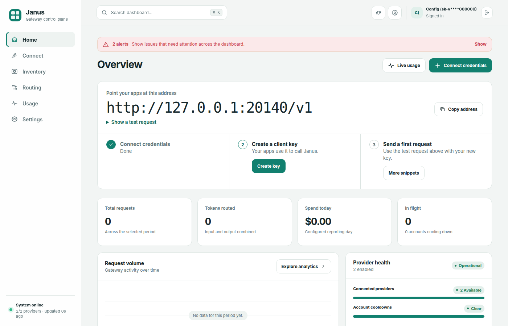
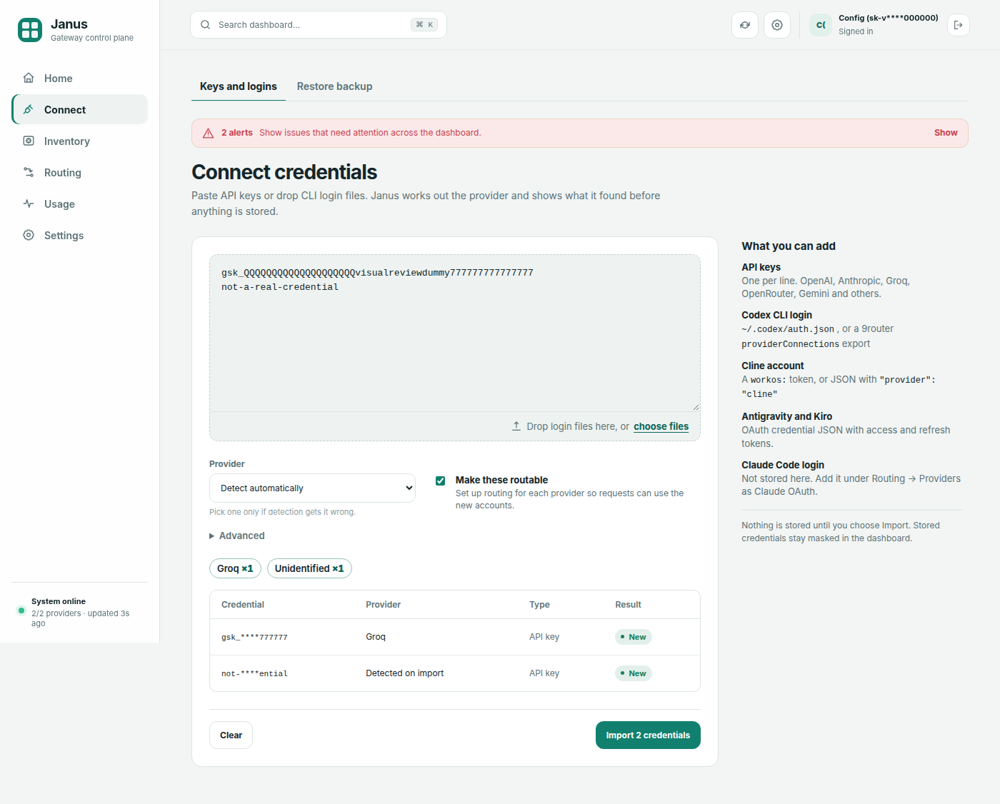
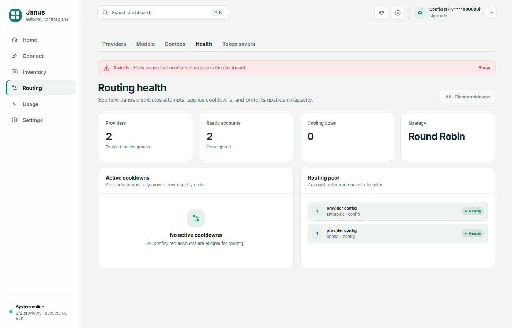

# Dashboard

Janus 3 includes **Cloudline**, a responsive control plane at `/dashboard/ui`.
It is a static SvelteKit 2, Svelte 5, and TypeScript application with modular
screens, responsive navigation, light/dark/system themes, and a searchable
command palette.

FastAPI serves the committed production bundle from
`src/janus/dashboard/static/app/`. Node.js and npm are development/build-time
dependencies only; a running Janus server does not need them. All Cloudline and
dashboard assets are served locally, so the interface has no runtime CDN dependency.

Open it in your browser:

```
http://localhost:20128/dashboard/ui
```

Cloudline is the only dashboard UI. The root URL `/`, `/dashboard`, and former
page URLs are compatibility redirects to their matching Cloudline routes.
Dashboard management APIs remain under `/dashboard/api`.

## Authentication

Every dashboard client must authenticate with a valid Janus API key, including
clients on `127.0.0.1` and `localhost`. There is no loopback bypass and no
username/password login. Unauthenticated browser requests are redirected to
`/dashboard/login`, which sets an httponly
`janus_dashboard_key` cookie (30-day max-age) scoped to the `/dashboard` path and
returns to the originally requested page. The cookie carries the `Secure`
attribute whenever the request arrives over HTTPS (behind a TLS-terminating
reverse proxy, forward `X-Forwarded-Proto`); plain-HTTP local development gets a
non-`Secure` cookie. The cookie is never accepted as a credential on `/v1/*` API
endpoints. Repeated failed login attempts from one IP are temporarily locked out,
and mutating dashboard requests whose `Origin` header differs from the request
host are rejected. API-style requests without a valid key or cookie receive `401`.

DB-managed keys must be active and have **Allow dashboard login**
(`can_login=true`). Static API keys configured in YAML are also accepted. Manage
DB-key access from **API Keys**; the **Require API key** setting controls API
endpoint authentication and never makes the dashboard anonymous.

Accepted auth methods (same as the API):

- `Authorization: Bearer <key>`
- `x-goog-api-key: <key>`
- `?key=<key>`

!!! warning "Credential migration"
    Legacy dashboard username/password settings are removed during database
    initialization. Use an authorized API key to sign in after upgrading.

## Navigation

The sidebar has six sections. Selecting a section opens its first tab, and a tab
strip under the page header switches between the section's pages. Every tab is a
real link with its own URL under `/dashboard/ui`, so back/forward navigation,
deep links, and bookmarks work as before. A section stays highlighted in the
sidebar while any of its tabs is open. On narrow viewports the sidebar becomes a
drawer, and the command palette (`Ctrl+K`, `Cmd+K`, or `/`) opens any tab
directly.

| Section | Tab | URL |
|---|---|---|
| **Home** | Overview | `/dashboard/ui` |
| **Connect** | Keys and logins | `/dashboard/ui/connect` |
| | Restore backup | `/dashboard/ui/connect/restore` |
| **Inventory** | Overview | `/dashboard/ui/inventory` |
| | Keys | `/dashboard/ui/inventory/keys` |
| **Routing** | Providers | `/dashboard/ui/providers` |
| | Models | `/dashboard/ui/models` |
| | Can't reach | `/dashboard/ui/models/unreachable` |
| | Combos | `/dashboard/ui/combos` |
| | Health | `/dashboard/ui/routing` |
| | Token savers | `/dashboard/ui/savers` |
| **Usage** | Live | `/dashboard/ui/usage` |
| | Analytics | `/dashboard/ui/analytics` |
| | Leaderboard | `/dashboard/ui/leaderboard` |
| | Request logs | `/dashboard/ui/request-logs` |
| **Settings** | General | `/dashboard/ui/settings` |
| | API keys | `/dashboard/ui/keys` |
| | Budgets | `/dashboard/ui/budgets` |
| | Pricing | `/dashboard/ui/pricing` |
| | Tools | `/dashboard/ui/tools` |

The former inventory URLs `/dashboard/ui/inventory/add` and
`/dashboard/ui/inventory/import` redirect to **Connect → Keys and logins** and
**Connect → Restore backup**. The theme control cycles through system, light,
and dark modes and stores the preference in the browser.

---

## Home

### Overview — `/dashboard/ui`



The landing page.

- **First-run checklist.** While setup is incomplete, a hero card lists three
  steps: **Connect credentials**, **Create a client key**, and **Send a first
  request**. Each step links to the screen that does it and is checked off once
  Janus sees a provider, an active client key, and a recorded request.
- **Your endpoint.** The API base URL for this server (for example
  `http://localhost:20128/v1`) and a copyable `curl` snippet for a first request.
  **Settings → Tools** has per-client setup.
- Below that: total requests, input/output tokens, provider and combo counts,
  today's total cost, and the global budget status bar.

## Connect

### Keys and logins — `/dashboard/ui/connect`



One screen for adding upstream credentials:

1. **Paste or drop.** Paste API keys (one per line) or a credential JSON export
   into the text area, or drop files onto the drop zone. Dropped files are read
   in the browser; nothing is uploaded until you preview.
2. **Choose options.** The provider selector defaults to **Auto** (detect the
   provider for each entry). Auto recognizes Codex CLI `auth.json`, 9router
   `providerConnections` exports, Cline, Antigravity, Kiro, and Claude Code (`.credentials.json`) credential JSON
   (see [Supported credential formats](inventory.md#supported-credential-formats));
   choose the provider yourself for a bare OAuth access token. Claude Code
   logins are accepted here as Claude Code (OAuth) inventory credentials. **Advanced** holds an optional
   custom base URL. **Make these routable** is on by default; it creates the
   matching routing provider when one is missing, so imported credentials join
   fallback rotation once they validate.
3. **Preview.** Janus calls `POST /dashboard/api/inventory/preview` and shows
   summary chips per provider (for example "Codex ×2, Groq ×1, 1 duplicate,
   1 unsupported"), then a table of masked entries. Each entry is **new**,
   **exists** (already in the inventory), or **rejected** with a reason. The
   preview never writes to the database.
4. **Import.** Import is enabled once at least one entry is new. It submits
   through the regular inventory submit endpoint, shows per-entry results, and
   refreshes while validation is still pending. Next-step buttons lead to
   **Inventory**, **Settings → API keys**, and a test request.

Credential values are masked throughout and rendered as text only. See
[Key Inventory — Supported credential formats](inventory.md#supported-credential-formats)
for what can be pasted.

### Restore backup — `/dashboard/ui/connect/restore`

Import a **Dashboard_For_Apis** JSON export (from another Janus node or a
compatible key manager) into the inventory.

## Inventory

### Overview — `/dashboard/ui/inventory`

Credit summary, provider cards, best keys, recent activity, and encryption
status.

### Keys — `/dashboard/ui/inventory/keys`

Filterable, paginated key list with per-key recheck, reveal, history, and
delete. See [Key Inventory](inventory.md) for full documentation.

## Routing

### Providers — `/dashboard/ui/providers`

Full CRUD for gateway providers:

- **Add / Edit** — set prefix, API type, base URL, API key, models, allowlists,
  and subscription quota
- **Test Connection** — 1-token probe with status and latency
- **Enable / Disable** — toggle without deleting
- **Delete** — remove provider (closes its HTTP client)

The provider workspace separates a logical provider prefix from its connections and
inventory accounts. Multiple enabled connections can share one prefix; Janus pools
their upstream accounts for fallback, cooldown, quota, and rate-limit-aware routing.
Custom models belong to that logical prefix, so deleting or disabling one connection
does not silently remove models that another same-prefix connection can serve.

Provider setup includes the catalog gallery and live **Fetch Models** helper.

When editing, leave the API key field **blank** to preserve the existing key.

Changes hot-reload — no server restart needed.

### Models — `/dashboard/ui/models`

Choose which models appear in the shared Janus catalog and `GET /v1/models`, and
add custom models to a provider prefix. Hidden models remain callable by exact
ID.

### Models you can't reach — `/dashboard/ui/models/unreachable`

Lists known models (catalog defaults, discovered inventory models, and models on
provider rows) that Janus cannot currently route, grouped by provider with the
reason (no provider, provider disabled, no active credential, or model not
enabled on any account). Each group has a button that opens
[Connect](#keys-and-logins--dashboarduiconnect) with that provider preselected,
or the Providers page when Connect cannot onboard it. Models whose every account
is cooling down are listed separately as **Reachable soon** — they are never
counted as unreachable.

### Combos — `/dashboard/ui/combos`

Full CRUD for fallback chains:

- **Create / Edit** — name and ordered model list
- **Delete** — remove combo

### Health — `/dashboard/ui/routing`

The Health tab also carries the **Auto routing** panel: pick the strategy used when a client
sends `model: "auto"` (`balanced`, `cheapest`, `fastest`, or `quality`) and see the ranked
model chain auto would pick right now. Request Logs show the model the request resolved to
next to the requested one.



- Enabled provider and account readiness at a glance
- Current account strategy and try order
- Active cooldowns with remaining duration
- Quota-deprioritized accounts and a guarded clear-cooldowns action

### Token savers — `/dashboard/ui/savers`

Toggle savers at runtime:

- **RTK** — on/off (default on)
- **Caveman** — on/off
- **Ponytail** — on/off with level selector (lite / full / ultra)
- **Headroom** — on/off with a configurable local proxy URL

Settings are stored in the DB and take effect immediately.

## Usage

### Live — `/dashboard/ui/usage`

- Live in-flight request count and recent gateway events
- Historical request volume, token use, and cost
- Automatic live-stream reconnection after transient disconnects

### Analytics — `/dashboard/ui/analytics`

- Spend trajectory for 7, 30, 90, or 365 days
- Breakdown by model, provider, account, or client key
- Request, token, cost, and success-rate summaries
- **Savings vs baseline.** What the window's priced traffic would have cost on
  a baseline model (default `gpt-4o`, changeable via the selector or the
  `analytics_savings_baseline` setting), how much routing actually spent, and a
  per-model table of the difference. Requests on subscription providers and
  unpriced models are excluded and reported separately — they never count as
  savings. API clients can read the same numbers from
  `GET /v1/analytics/savings?baseline=&days=`. Home shows the same comparison
  for the configured reporting day as a **Saved today** tile.

### Leaderboard — `/dashboard/ui/leaderboard`

- Rank clients by tokens, cost, or requests
- Compare request volume, success rate, token use, and cost

### Request logs — `/dashboard/ui/request-logs`

Debug view of captured API requests (**off by default** — enable **Request
Logging** under Settings → General, or set `server_request_logging=true`):

- Paginated table of recent requests: time, model, provider, status, and latency
- Per-request JSON detail (full request/response bodies, truncated at 64 KB)
- Successful completions (stream + non-stream), exhausted fallbacks (`503`), and
  non-fallback upstream errors (e.g. `400`) are recorded when logging is on
- Export all logs as JSON; Clear button wipes the table
- Retention is **configurable** via `server_request_log_retention` (default
  `500`, clamped between 50 and 5000) on the Settings page — oldest rows
  beyond the limit are pruned automatically

The table also has a **User** column. It shows the DB-issued key name,
the configured static-key label (`client_key_label`), or `—` when an API request
was allowed without a client key.

If the page is empty, logging is almost always still disabled — check the banner
and the Settings toggle.

!!! warning "Sensitive content"
    Captured bodies contain prompts and completions. Leave request logging off
    unless actively debugging.

## Settings

### General — `/dashboard/ui/settings`

- **Require API key** — runtime toggle (stored in DB, overrides YAML default)
- **Enable account cooldowns** — when on (default), accounts that hit 429/5xx/auth/network
  errors are skipped until their cooldown expires. Turn off to override and keep
  retrying those accounts immediately (`server_cooldowns_enabled`). Also available
  via `janus settings set server_cooldowns_enabled false`
- **Sticky client routing** and account strategy
- **Reporting timezone** and request-log retention
- **Request Logging** — capture full request/response bodies for debugging (off by default), plus the log retention limit
- **Prompt cache** — serve cached responses for deterministic requests at zero cost
  (off by default; see below)
- **Export secrets** — download current DB state as YAML after an explicit
  plaintext-credential warning

Settings also exposes advanced combo routing controls (`combo_strategy`, sticky
limit, and Fusion tuning), server information, and **Reset to Defaults**. See
[Combos & Fallback](combos.md#combo-strategies) for the routing fields. Values
are validated server-side, and reset wipes the relevant DB state before
re-seeding from `config.yaml`.

### Prompt cache

When **Prompt cache** is enabled (`server_prompt_cache_enabled`), Janus serves
an exact-match cached response — before any upstream call — for *deterministic*
requests:

- explicit `temperature=0` without a narrowed `top_p` (`top_p` unset or `1.0`), or
- a pinned `seed`,

and only for non-streaming requests. The cache key covers the full
post-saver canonical request plus every output-shaping parameter (`max_tokens`,
`stop`, `n`, penalties, `logit_bias`, `tool_choice`, thinking intent, …) and is
scoped per client API key, so completions never leak across keys. Token-saver
normalization (RTK, Caveman, …) happens before the key is computed, so savers
increase the hit rate.

A cache hit returns the original response with an `x-janus-cache: hit` header,
records zero-cost usage, and appears in Request Logs with the provider shown as
`prompt-cache`. Entries are bounded by `server_prompt_cache_ttl_s` (default
3600) and `server_prompt_cache_max_entries` (default 128, LRU eviction).
Responses are cached in memory only and are not persisted across restarts.

Settings does not contain a dashboard username or password. Dashboard identity
and access are API-key based, and **Settings → API keys** is the place to grant or revoke
**Allow dashboard login**. Any legacy username/password settings are purged at
database initialization.

On **Routing → Health**, use **Clear all cooldowns** to wipe active in-memory and SQLite
cooldown timers without changing the enable toggle.

### API keys — `/dashboard/ui/keys`

- **Key list** — ID, prefix, name, login permission, model allowlist, status (active/revoked)
- **Create** — modal with **Allow dashboard login**, allowed models (`exact` or
  `prefix/*`), and daily/absolute budgets; full `sk-janus-...` key shown **once**
- **Edit** — update name, dashboard access, models, or either budget; blank budget fields remove their limits
- **Revoke** — deactivate key

### Budgets — `/dashboard/ui/budgets`

- **Budget list** — scope (global or key name), daily limit, spent today,
  absolute lifetime limit, spent total, warning threshold, and status (`ok` / `warning` / `exceeded`)
- **Create/edit** — select a scope, enter a daily limit, an absolute limit for a specific
  key, or both, and choose a warning percentage. Absolute limits never reset and include past usage.
- **Delete** — remove both limits without deleting the key or its spending history

### Pricing — `/dashboard/ui/pricing`

- View all ~28 builtin model prices
- **Add / Edit / Delete** custom pricing overrides
- Overrides merge with builtins at request recording time

### Tools — `/dashboard/ui/tools`

Copy-paste environment variable cards for:

- Claude Code
- Codex
- Cursor
- Cline

Each card shows the exact `export` commands for your server URL and auth settings.

---

## Management API

Cloudline reads authenticated, non-cacheable JSON state from the v2 API and
uses the dashboard management API for mutations. Responses are structured data,
not server-rendered or HTMX fragments. The v2 state responses include `section`,
`alerts`, `data`, and `meta`; credentials and other sensitive fields are removed
before serialization.

| Method | Path | Action |
|---|---|---|
| `GET` | `/dashboard/api/v2/state/{section}` | Read state for a Cloudline screen |
| `POST` | `/dashboard/api/v2/keys` | Create an API key and return its plaintext value once |

Supported state sections are `overview`, `usage`, `analytics`, `leaderboard`,
`request-logs`, `inventory`, `inventory-keys`, `providers`, `combos`, `routing`,
`savers`, `budgets`, `keys`, `tools`, `pricing`, and `settings`. Every request
requires dashboard access; state and one-time credential responses use
`Cache-Control: private, no-store`.

The management endpoints below return structured responses. For scripting,
prefer the [CLI](cli.md).

### API Keys

| Method | Path | Action |
|---|---|---|
| `POST` | `/dashboard/api/v2/keys` | Create an API key and return its plaintext value once |
| `POST` | `/dashboard/api/keys/{id}` | Update key scopes and optional daily/absolute budgets |
| `DELETE` | `/dashboard/api/keys/{id}` | Revoke an API key |

### Budgets

| Method | Path | Action |
|---|---|---|
| `POST` | `/dashboard/api/budgets` | Create or update a budget |
| `DELETE` | `/dashboard/api/budgets/{id}` | Delete a budget |

Budget forms accept `key_select` (a key ID or `global`), `daily_limit`,
`absolute_limit`, and `warn_pct`. Absolute limits require a specific key and count
its all-time recorded spending; they never reset. Either or both limits may be set.
An omitted limit preserves its existing value; a submitted blank limit removes it.
At least one limit must remain, or delete the budget instead.

Key create/edit forms use `daily_budget` and `absolute_budget`. On key edit,
`budget_fields=1` marks both budget fields as intentional: blanks clear their limits.
Without that marker, omitted or blank values leave existing budgets unchanged.
See [Budgets](budgets.md) for setup examples and enforcement details.

### Providers

| Method | Path | Action |
|---|---|---|
| `POST` | `/dashboard/api/providers` | Create provider |
| `PUT` | `/dashboard/api/providers/{id}` | Update provider |
| `DELETE` | `/dashboard/api/providers/{id}` | Delete provider |
| `POST` | `/dashboard/api/providers/fetch-models` | Fetch models from upstream |
| `POST` | `/dashboard/api/providers/{id}/test` | Test connection |

### Combos

| Method | Path | Action |
|---|---|---|
| `POST` | `/dashboard/api/combos` | Create combo |
| `PUT` | `/dashboard/api/combos/{id}` | Update combo |
| `DELETE` | `/dashboard/api/combos/{id}` | Delete combo |

### Settings & config

| Method | Path | Action |
|---|---|---|
| `POST` | `/dashboard/api/settings` | Update runtime settings (savers, require_api_key, request logging) |
| `GET` | `/dashboard/api/export` | Export DB config as a YAML download (provider API keys omitted unless `?include_secrets=true`) |
| `POST` | `/dashboard/api/reset` | Reset DB and re-seed from YAML |
| `GET` | `/dashboard/api/request-logs/export` | Export captured request logs as JSON |
| `GET` | `/dashboard/api/request-logs/{id}` | Full detail for one captured request |
| `DELETE` | `/dashboard/api/request-logs` | Clear all captured request logs |

### Pricing

| Method | Path | Action |
|---|---|---|
| `POST` | `/dashboard/api/pricing` | Create or update pricing override |
| `DELETE` | `/dashboard/api/pricing/{model}` | Delete pricing override |

### Inventory

| Method | Path | Action |
|---|---|---|
| `POST` | `/dashboard/api/inventory/preview` | Classify pasted keys or credential JSON without storing them (masked, no database writes) |
| `POST` | `/dashboard/api/inventory/submit` | Add keys to the inventory (used by **Connect** with `provision_routing=true`) |

See [Key Inventory — Preview API](inventory.md#preview-api) for the preview
response, and [Key Inventory — Push API](inventory.md#push-api) for
`POST /dashboard/api/inventory/push`.

Former page routes under `/dashboard` are compatibility redirects to matching
screen names under `/dashboard/ui`; API routes remain under `/dashboard/api`.
